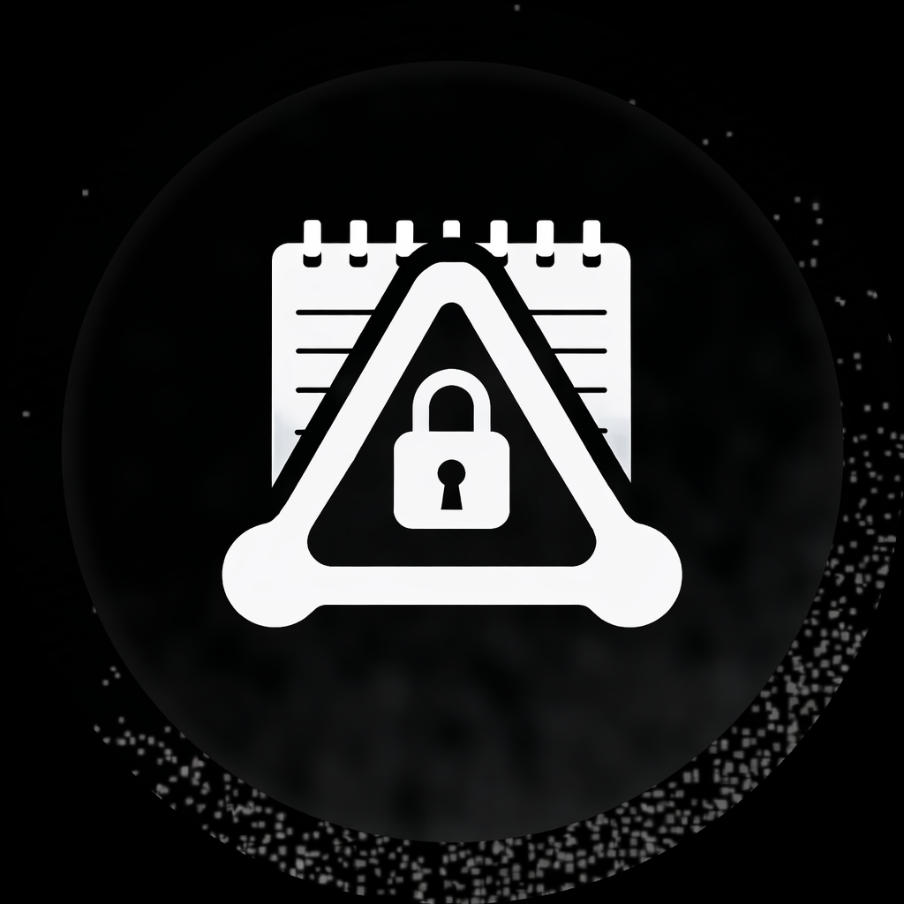

# PrivatePad

<p align="center">
  
</p>

<p align="center">
  <strong>A zero-knowledge encrypted vault for notes and media</strong><br/>
  <em>iOS & Android • React Native • Military-grade encryption</em>
</p>

---

**PrivatePad** is a secure, encrypted application for iOS and Android built with React Native. Store encrypted notes and media files locally on your device with biometric protection. Your data never leaves your device—no cloud, no servers, no tracking.

---

## Features

###  Encrypted Notes
- End-to-end encryption using TweetNaCl (XSalsa20-Poly1305)
- Biometric authentication (Face ID / Touch ID / Fingerprint)
- Notes stored locally on device—no cloud, no servers
- Auto-save with debouncing
- Distraction-free writing interface

###  Secure Media Vault
- Encrypt photos, videos, and documents (PDF, DOC, TXT)
- Import from camera, photo library, or file picker
- Real-time thumbnail generation with encrypted storage
- Password-protect individual files with scrypt key derivation
- Secure deletion with multi-pass data overwrite

###  Encrypted File Sharing (.ppenc)
- Export password-protected files as portable `.ppenc` bundles
- Import encrypted bundles from other PrivatePad users
- Share sensitive files securely—recipient needs only the password
- Full interoperability across iOS and Android

###  Appearance
- Dark mode support (system, light, or dark)
- Clean, modern UI with smooth animations

---

## Security Architecture

### Overview

PrivatePad uses a **zero-knowledge** architecture where your encryption keys never leave your device. All notes and media are encrypted before being written to storage and can only be decrypted with biometric authentication.

```
┌─────────────────────────────────────────────────────────────────┐
│                        SECURITY FLOW                            │
├─────────────────────────────────────────────────────────────────┤
│                                                                 │
│  ┌──────────────┐    ┌──────────────┐    ┌──────────────────┐  │
│  │   Biometric  │───▶│   Keychain   │───▶│   Secret Key     │  │
│  │     Auth     │    │   (Secure)   │    │   Retrieved      │  │
│  └──────────────┘    └──────────────┘    └────────┬─────────┘  │
│                                                    │            │
│                                                    ▼            │
│  ┌──────────────┐    ┌──────────────┐    ┌──────────────────┐  │
│  │  Plain Text  │───▶│   TweetNaCl  │───▶│  Encrypted Data  │  │
│  │   / Media    │    │   Encrypt    │    │    (Storage)     │  │
│  └──────────────┘    └──────────────┘    └──────────────────┘  │
│                                                                 │
└─────────────────────────────────────────────────────────────────┘
```

### Cryptographic Primitives

| Component | Algorithm | Library |
|-----------|-----------|---------|
| Symmetric Encryption | XSalsa20-Poly1305 | TweetNaCl `secretbox` |
| Password Key Derivation | scrypt (N=16384, r=8, p=1) | `@stablelib/scrypt` |
| Key Generation | Cryptographically secure random | `react-native-get-random-values` |
| Key Storage | iOS Keychain / Android Keystore | `react-native-keychain` |
| Data Storage | AES-256 encrypted storage | `react-native-encrypted-storage` |

### Per-Item Password Protection

Individual media files can be password-protected with an additional layer of encryption:

```
┌─────────────────────────────────────────────────────────────────┐
│              PASSWORD PROTECTION FLOW                           │
├─────────────────────────────────────────────────────────────────┤
│                                                                 │
│  ┌──────────────┐    ┌──────────────┐    ┌──────────────────┐  │
│  │   Password   │───▶│    scrypt    │───▶│  Derived Key     │  │
│  │              │    │   + Salt     │    │   (32 bytes)     │  │
│  └──────────────┘    └──────────────┘    └────────┬─────────┘  │
│                                                    │            │
│                                                    ▼            │
│  ┌──────────────┐    ┌──────────────┐    ┌──────────────────┐  │
│  │  Decrypted   │───▶│   TweetNaCl  │───▶│  Re-encrypted    │  │
│  │    File      │    │   secretbox  │    │   with PW key    │  │
│  └──────────────┘    └──────────────┘    └──────────────────┘  │
│                                                                 │
└─────────────────────────────────────────────────────────────────┘
```

### Portable Encrypted Format (.ppenc)

Password-protected files can be exported as `.ppenc` bundles for secure sharing:

```json
{
  "version": 1,
  "format": "privatepad-encrypted",
  "filename": "document.pdf",
  "mimeType": "application/pdf",
  "fileSize": 102400,
  "ciphertext": "<base64 encrypted data>",
  "nonce": "<24-byte nonce>",
  "salt": "<32-byte scrypt salt>",
  "createdAt": 1706889600000
}
```

Recipients can import `.ppenc` files into their own PrivatePad and either:
- Keep password protection (file remains locked with original password)
- Remove protection (re-encrypt with their master key)

---

## Note Storage

### How Notes Are Saved

Each note goes through the following process:

```
┌─────────────────────────────────────────────────────────────────┐
│                     NOTE SAVE PROCESS                           │
├─────────────────────────────────────────────────────────────────┤
│                                                                 │
│  1. Note Content                                                │
│     { title: "My Note", content: "Secret text..." }             │
│                          │                                      │
│                          ▼                                      │
│  2. Serialize to JSON string                                    │
│     '{"title":"My Note","content":"Secret text..."}'            │
│                          │                                      │
│                          ▼                                      │
│  3. Generate random 24-byte nonce                               │
│     nacl.randomBytes(24)                                        │
│                          │                                      │
│                          ▼                                      │
│  4. Encrypt with TweetNaCl secretbox                            │
│     nacl.secretbox(message, nonce, secretKey)                   │
│                          │                                      │
│                          ▼                                      │
│  5. Store encrypted note                                        │
│     {                                                           │
│       id: "abc123",                                             │
│       encryptedData: "base64...",  // Ciphertext                │
│       nonce: "base64...",          // Required for decrypt      │
│       createdAt: 1234567890,                                    │
│       updatedAt: 1234567890                                     │
│     }                                                           │
│                                                                 │
└─────────────────────────────────────────────────────────────────┘
```

### Storage Structure

```
Encrypted Storage Keys:
├── privatepad_onboarding    → "completed" | "not_started"
├── privatepad_user          → { name, createdAt, publicKey }
├── privatepad_notes_index   → [{ id, title, updatedAt }, ...]
├── privatepad_note_abc123   → { id, encryptedData, nonce, ... }
├── privatepad_media_index   → [{ id, type, filename, ... }, ...]
└── ...

Device Keychain:
└── privatepad_secret_key    → 32-byte encryption key (biometric protected)

Vault Directory (encrypted files):
├── vault/
│   ├── <id>.enc             → Encrypted media files
│   └── thumbs/
│       └── <id>.thumb.enc   → Encrypted thumbnails
```

---

## Project Structure

```
src/
├── App.tsx                      # Root component, auth flow routing
├── types/
│   └── index.ts                 # TypeScript interfaces
├── services/
│   ├── cryptoService.ts         # TweetNaCl encrypt/decrypt + scrypt
│   ├── keychainService.ts       # Biometric key storage
│   ├── storageService.ts        # Note CRUD operations
│   ├── mediaStorageService.ts   # Media vault + .ppenc import/export
│   └── permissionService.ts     # Camera/photo library permissions
├── components/
│   ├── NotesDrawer.tsx          # Side menu for note selection
│   ├── PasswordModal.tsx        # Password entry for protected items
│   ├── MediaItemActionSheet.tsx # Long-press actions menu
│   └── ImportChoiceModal.tsx    # .ppenc import options
├── context/
│   └── ThemeContext.tsx         # Dark/light mode theming
└── screens/
    ├── OnboardingScreen.tsx     # First-time setup flow
    ├── NotesScreen.tsx          # Main note editor UI
    ├── MediaVaultScreen.tsx     # Encrypted photo/video/doc vault
    ├── MediaViewerScreen.tsx    # Full-screen media viewer
    └── SplashScreen.tsx         # Branded loading screen
```

---

## Getting Started

### Prerequisites

- Node.js >= 18
- React Native development environment set up
- Xcode (for iOS)
- Android Studio (for Android)

### Installation

```bash
# Clone the repository
git clone <repo-url>
cd PrivatePad

# Install dependencies
npm install

# Install iOS pods
cd ios && pod install && cd ..
```

### Running the App

```bash
# Start Metro bundler
npm start

# Run on iOS
npm run ios

# Run on Android
npm run android
```

### Testing Biometrics

**iOS Simulator:**
- Features > Face ID > Enrolled
- Features > Face ID > Matching Face (to simulate success)

**Android Emulator:**
- Extended Controls > Fingerprint > Touch sensor

---

## Security Considerations

### What's Protected

✅ Note content (title + body) - encrypted with XSalsa20-Poly1305  
✅ Media files (photos, videos, documents) - encrypted with XSalsa20-Poly1305  
✅ Thumbnails - separately encrypted  
✅ Encryption key - stored in secure hardware (Keychain/Keystore)  
✅ All storage uses react-native-encrypted-storage (AES-256)  
✅ Optional per-item password protection with scrypt key derivation  
✅ Secure deletion with multi-pass random data overwrite  
✅ Screenshot prevention (Android FLAG_SECURE)  

### Threat Model

| Threat | Mitigation |
|--------|------------|
| Device theft | Biometric auth required to access keys |
| App data extraction | All files encrypted, key in secure enclave |
| Memory dump | Keys only in memory when authenticated |
| Man-in-the-middle | No network communication (offline only) |
| Forensic recovery | Secure delete overwrites data before unlinking |
| Password brute force | scrypt with high cost parameters (N=16384) |

### Limitations

⚠️ If device is unlocked and app is open, decrypted data is in memory  
⚠️ No cloud backup - if you lose your device, data is lost  
⚠️ Jailbroken/rooted devices have reduced security guarantees  

---

## Dependencies

| Package | Purpose |
|---------|---------|
| `react-native` | 0.77.3 - Core framework |
| `tweetnacl` | NaCl cryptographic library (XSalsa20-Poly1305) |
| `@stablelib/scrypt` | scrypt key derivation for password protection |
| `react-native-keychain` | Secure key storage with biometrics |
| `react-native-encrypted-storage` | Encrypted AsyncStorage |
| `react-native-get-random-values` | Crypto PRNG polyfill |
| `react-native-fs` | File system access for media vault |
| `react-native-image-picker` | Camera and photo library access |
| `react-native-document-picker` | Document/PDF file selection |
| `react-native-video` | Video playback |
| `react-native-pdf` | PDF document viewing |
| `react-native-share` | Native share sheet for .ppenc export |
| `@bam.tech/react-native-image-resizer` | Efficient thumbnail generation |

---

## License

This project is licensed under the **Creative Commons Attribution-NonCommercial 4.0 International License (CC-BY-NC-4.0)**.

### License Summary

- ✅ **Share** — copy and redistribute the material in any medium or format
- ✅ **Adapt** — remix, transform, and build upon the material
- ⚠️ **Attribution** — You must give appropriate credit and indicate if changes were made
- ❌ **NonCommercial** — You may not use the material for commercial purposes

Full license text: [LICENSE.txt](./LICENSE.txt)  
SPDX Identifier: `CC-BY-NC-4.0`  
Official License: https://creativecommons.org/licenses/by-nc/4.0/

---

## Intellectual Property & Ownership

### Copyright Holder

**Cryptic Technologies — 17030452 Canada Inc.**

All intellectual property rights, including but not limited to the source code, design, documentation, and cryptographic architecture of PrivatePad, are owned by Cryptic Technologies (17030452 Canada Inc.) and its primary developer @CascadiaTech

### PGP Signature Verification

The ownership and authenticity of this license is cryptographically verified using a PGP digital signature.

| File | Description |
|------|-------------|
| [LICENSE.txt](./LICENSE.txt) | The complete license text |
| [LICENSE.txt.asc](./LICENSE.txt.asc) | Detached PGP signature proving IP ownership |

The PGP signature in `LICENSE.txt.asc` was created by the private key holder of Cryptic Technologies. This cryptographic proof establishes that:

1. The license was issued by the legitimate IP owner
2. The license text has not been tampered with
3. The signing key belongs to Cryptic Technologies (17030452 Canada Inc.)

#### Verifying the Signature

To verify the authenticity of the license and IP ownership:

```bash
# Import the Cryptic Technologies public key (if not already imported)
gpg --keyserver keyserver.ubuntu.com --recv-keys <KEY_ID>

# Verify the signature
gpg --verify LICENSE.txt.asc LICENSE.txt
```

A successful verification confirms that the owner of the PGP signing key is the rightful intellectual property owner of this software as specified in the license.

---

<p align="center">
  <sub>Built with love by <a href="https://cryptictechnologies.co">Cryptic Technologies</a></sub>
</p>
